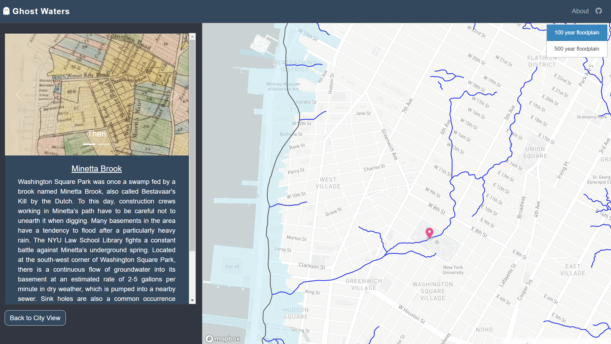

# Ghost Waters of NYC

## Introduction
The inspiration behind this project was learning about the [Tibbetts Brook daylighting](https://www.nytimes.com/2021/12/06/nyregion/tibbets-brook-bronx-daylighting.html) proposal in my neighborhood (Kingsbridge, Bronx). I started wondering how many other ghost streams there must be around the city that were forced underground or into sewers as the land was developed around them that continue to haunt us during storm events and even on a daily basis by creating sink holes and taxing our wastewater management systems. Restoring them to the surface could create new habitats and recreational spaces, reduce flood risk, lighten the load on our wastewater treatment systems, and clean our waterways by reducing combined sewage overflow (CSO) events. In addition to possible stream restoration and resiliency projects, this map also tells the story of several bodies of water that appear to be truly lost- filled in and paved over, with no current signs of existence.

This project was created as the final project for my Interactive Web Mapping course at NYU Wagner, taught by [Chris Whong](https://github.com/chriswhong).
## How to Use
Navigating to individual stories by clicking a button or marker allows the user to learn about that particular stream, see a representation of the historical stream (typically an old map where to artwork is available), and a photo of the site in the present day. Clicking the title or the link at the bottom of the description opens a new tab with the source site for the information. Clicking the `Back to City View` button allows the user to return to the full map view.

In the full map view, the user is free to zoom in to areas of interest, where they can observe flooding risk by toggling the 100 year and 500 year floodplain layers and better understand the original hydrology of the area, including the pre-development shoreline and water bodies.

## Data Sources
This map uses data from the following sources:
- [Welikia Project](https://welikia.org/about/overview/) : shapefiles for the 1609 shoreline and streams. This is an ongoing project, and the only streams data published for now are Manhattan, West Bronx, and Newtown Creek.
-  [NYC Mayor's Office of Climate and Sustainability ](https://data.cityofnewyork.us/Environment/Sea-Level-Rise-Maps-2050s-500-year-Floodplain-/qwca-zqw3):  NYC Stormwater flood maps for the 2050s based on FEMA's Preliminary Work Map data and the New York Panel on Climate Change's 90th Percentile Projects for Sea-Level Rise.
-  [NYC Department of City Planning](https://data.cityofnewyork.us/City-Government/Borough-Boundaries/tqmj-j8zm): Borough boundaries (to clip floodplain data to).
-  [New York State Department of Environmental Conservation](https://data.ny.gov/Energy-Environment/Combined-Sewer-Overflows-CSOs-Map/i8hd-rmbi): locations of combined  sewer overflow (CSOs) outfall locations in NYS.

The additional information presented in the map such as the stream descriptions, photos, and present and planned path of Tibbetts Brook are from a mix of sources cited in the `markers.geojson` file. For Tibbetts Brook, I have written an extensively researched policy memo in support of its daylighting, the executive summary of which is used as the description for the Tibbetts Brook story in this project. That paper is available upon request.
## Methods
I used QGIS 3.10 for data processing. This included fixing geometries and clipping floodplain layers to the borough boundaries, filtering the CSO data to only the ones I needed, converting shapefiles to geoJSON, and changing CRS to WGS84:4326. I also used [geojson.io](geojson.io) to draw the intended path for Tibbetts Brook, the Broadway sewer main, and the pre-development shoreline for the West Bronx (based on a visual of the Welikia map, as this data layer was not made available for download).
## Future Plans
Though the final project has a deadline, I'd like to come back to this project in the future and add more stories as I reseach them, including adding stream layers as either the Welika Project makes them available or if I myself can draw them based on static maps I find (i.e. [this map of Gowanus](https://www.vice.com/en/article/ezv544/the-hunt-for-brooklyns-hidden-creeks)). I would also like to figure out how to not have to have separate code for marker creation and zooming to the site when clicking from a marker versus a button. I might add features like distinguishing markers based on whether any stream restoration propsals are involved, and make the site mobile-compatible.  
## About the Author
Hello, I'm Renata. During the day I'm an electrical engineer working on adding solar PV, energy storage, and electric vehicle chargers to the NYC grid. In the evening I'm a Master of Urban Planning student at NYU Robert F. Wagner Graduate School of Public Service, focusing on climate resiliency and infrastructure planning. At night, I like to sleep. When I'm not doing one of the above, I enjoy riding my bike around NYC and exploring forgotten places, volunteering at clean-up and gardening events, and hiking in the near-upstate with my husband and friends.
