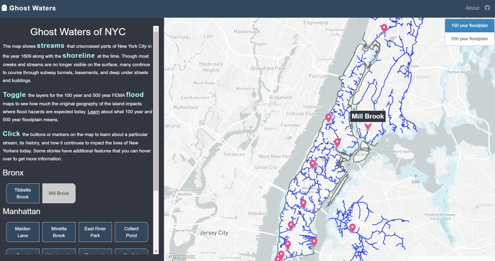

# Lost Waters of NYC

## Introduction

## Data Sources
This map use data from the following sources:
- [Welikia Project](https://welikia.org/about/overview/) : shapefiles for the 1609 shoreline and streams. 
-  [NYC Mayor's Office of Climate and Sustainability ](https://data.cityofnewyork.us/Environment/Sea-Level-Rise-Maps-2050s-500-year-Floodplain-/qwca-zqw3):  NYC Stormwater flood maps for the 2050s based on FEMA's Preliminary Work Map data and the New York Panel on Climate Change's 90th Percentile Projects for Sea-Level Rise.
-  [NYC Department of City Planning](https://data.cityofnewyork.us/City-Government/Borough-Boundaries/tqmj-j8zm): Borough boundaries (to clip floodplain data to).
-  [New York State Department of Environmental Conservation](https://data.ny.gov/Energy-Environment/Combined-Sewer-Overflows-CSOs-Map/i8hd-rmbi): locations of combined  sewer overflow (CSOs) outfall locations in NYS.

The additional information presented in the map such as the stream descriptions, photos, and present and planned path of Tibbetts Brook are from a mix of sources cited in the markers.geojson file. For Tibbetts Brook, I have written an extensively researched policy memo in support of its daylighting, the executive summary of which is used as the description for the Tibbetts Brook story in this project. That paper is available upon request. 
## Methods
